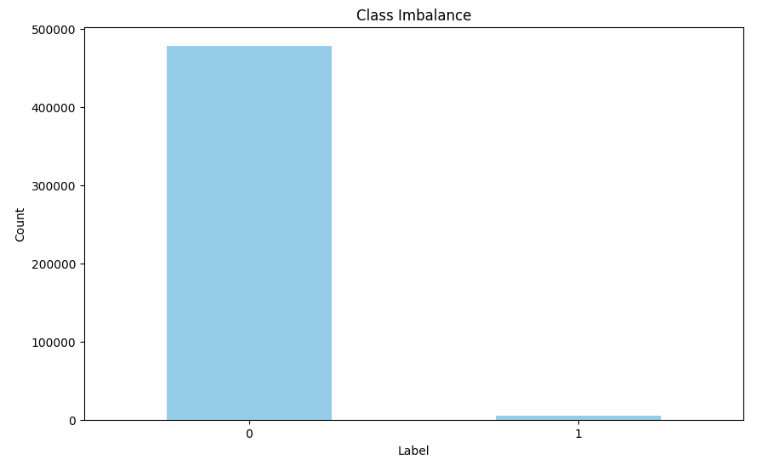
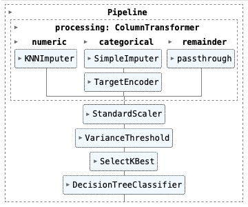

# Data Science - Classification

## Project Title

**Classification of Benign and Malware Domains**

## Description

This project is aimed at developing a machine learning model for the classification of internet domains into two categories: "Benign" and "Malicious." The internet is host to a vast number of domains, and it's crucial to identify potentially harmful domains to enhance cybersecurity and protect users from threats.

The project leverages various data science techniques, including data collection, feature engineering, and model training, to create a classification system that can automatically distinguish between benign domains (safe and trustworthy) and malicious domains (associated with harmful activities such as phishing, malware, or other security risks).

## Table of Contents

- Project Structure
- Installation
- Data
- Data Exploration and Analysis
- Methods and Models
- Performance Metrics and Interpretation
- Handling Unseen and New Data
- Future Work


## Project Structure

- `Data/`: Contains dataset files.
- `Images/`: Jupyter notebooks for data exploration and analysis.
- `environment.yaml`: Environment file.
- `1_Data_Preparation.ipynb` - data cleaning notebook
- `2_Classification_Models.ipynb` - model training and results notebook
- `Readme.md` - Readme file

## Installation

To ensure consistency and reproducibility, we use Conda to manage the project's environment. The `environment.yaml` file contains all the dependencies required for this project. Follow these steps to set up the environment:

1. **Clone the Repository:**
```bash
    git clone https://github.com/szafranskifilip/ML_Academy.git
    cd projectlocation
```
2. **Create the Conda Environment**:
```bash
    conda env create -f environment.yaml
```
3. **Activate the Environment**:
```bash
   conda activate domain-classifier
```
4. **Install Libraries**:
```bash
    pip install scikit-learn
    pip install imblearn
```


## Data

Dataset Description

Source: The dataset, known as CIC-Bell-DNS2021, is a collection of DNS features extracted from benign and malicious domains. The domains used in the dataset were gathered from various sources, categorized into benign, spam, phishing, and malware domains. 

Dataset Contents

Benign and Malicious Domains: The dataset includes a total of 478,613 benign domains and 4,977 malicious domains. These domains were processed from a larger set of one million benign domains and 51,453 known-malicious domains, sourced from publicly available datasets.

Class imbalance: 1:95


Format

The dataset is  provided in a structured format, which includes features extracted from the DNS traffic of the domains. The features include various DNS statistical features, lexical features, and third-party-based features (e.g., Whois and Alexa Rank information). The data is organized in a tabular format, a CSV file, where each row represents a domain and the columns represent the extracted features. The dataset comprise of 39 columns. 

## Data Exploration and Analysis

#### Data Summary - NaN and Unique Values

Dataset summary of Nan and unique values and their percentages. It helps to identify i.e. the columns with significant number of NaN values to be dropped or encoding method of categorical data (low vs high cardinality). Based on the summary below we can notice that most of the categorical data is high cardinality. There is also a column that the number of NaN values exceeds 90% and it will be dropped.


#### Data Summary - Class Imbalance



#### Data Cleaning

Dataset Preview


Above we can see the data initial shape after concatenating two csv files and assigning labels.

Below are few data **cleaning steps** which were taken to prepare the data for a pipeline:

1. Drop duplicates if the number of NaN values exceeds 75%

```python 
# Set the threshold for missing data (75%)
threshold = 0.25 * len(df_concat)
# Drop columns with missing data exceeding the threshold
df_concat = df_concat.dropna(thresh=threshold, axis=1)
```

2. Convert 'Creation_Date_Time' to a proper date format. The errors parameter can be set to 'coerce,' which forces any parsing errors to be set as NaT (Not a Timestamp). Next create two numerical columns which comprises of the year and month. Drop 'Creation_Date_Time'. 

```python 
df_concat['Creation_Date_Time'] = pd.to_datetime(df_concat['Creation_Date_Time'], errors='coerce')

# Create 'Year' and 'Month' columns
df_concat['Year'] = df_concat['Creation_Date_Time'].dt.year
df_concat['Month'] = df_concat['Creation_Date_Time'].dt.month

# Drop datetime column
df_concat = df_concat.drop(columns=['Creation_Date_Time'])
```

3. Use RegEx to extract the domain age in days and convert it to numerical dtype

```python
# Use regex to extract the number of days from Domain_Age column
df_concat['Domain_Age'] = df_concat['Domain_Age'].str.extract(r'(\d+) days').astype(float)
```

4. Identify columns with 'object' data type that can be converted to numbers. Tis divission will be necessary for further data transformations in the pipeline.

```python 
# Determine which columns can be converted to numeric data type
numerical_columns = ['TTL','hex_32','hex_8', 'Alexa_Rank', 'subdomain', 'len', 'oc_32', 'shortened', 'entropy', 'obfuscate_at_sign', 'ASN', 'dec_8', 'dec_32', 'numeric_percentage', 'puny_coded', 'oc_8', 'Name_Server_Count', 'Page_Rank', 'Year', 'Month', 'label', 'Domain_Age']

# Convert to numeric data type
df_concat[numerical_columns] = df_concat[numerical_columns].apply(pd.to_numeric, errors='coerce')

# Determine which columns are categorical data type by dropping numeric columns
categorical_columns = df_concat.drop(columns=numerical_columns).columns

```

5. Remove inf values - an important step is to identify and convert inf values

```python 
df_concat.isin([np.inf, -np.inf]).any().any()
True
df_concat = df_concat.replace([np.inf, -np.inf], np.nan)
```

6. Save cleaned up dataset to a pickle file


## Methods and Models

#### Data Split

In this project, we used Scikit-Learn and imbalanced-learn (imblearn) libraries to manage our dataset for classification.

We split our dataset into training and testing sets to assess our machine learning models' performance. We used the widely accepted 70/30 split, where 70% of the data was allocated to the training set and 30% to the testing set. To accomplish this, we leveraged Scikit-Learn's train_test_split.

#### Addressing Class Imbalance

We encountered a class imbalance issue in our dataset, with a skewed distribution of a 1:95 ratio between the minority and majority classes. To address this imbalance, we utilized the imbalanced-learn library (imblearn). The library provides various resampling techniques to ensure that our models do not disproportionately favor the majority class. Here's a brief overview of how we tackled the class imbalance:

- We imported the necessary imblearn modules, such as RandomUnderSampler.
- We applied the RandomUnderSampler to undersample the majority class while preserving all instances of the minority class. Sampling_strategy=0.8

This resampling technique helped to create a balanced training set that the models could learn from effectively.

#### Cross-Validation for Model Assessment
In later stages of the project, cross-validation techniques can be incorporated to more thoroughly assess our model's performance. Cross-validation involves dividing the data into multiple subsets and training/evaluating the model on different combinations. This method provides a more robust estimate of our model's ability to generalize to unseen data and helps ensure our results are not overly dependent on the initial train-test split.


#### Data Transformation and Pipelines

In the domain classification project, effective data preprocessing is crucial for building a robust and accurate classification model to distinguish between benign and malicious domains. To achieve this, we've established a comprehensive data processing workflow using scikit-learn pipelines.

**1. Data Transformation Pipelines**

We begin by addressing the various data types present in our dataset, specifically numeric and categorical data. These pipelines are designed to handle data imputation, encoding, and transformation:

**a. Numeric Data Transformation Pipeline:**

Imputation: Missing values in numerical features are handled using the K-Nearest Neighbors (KNN) imputer. This technique leverages the proximity of data points to estimate missing values accurately.

**b. Categorical Data Transformation Pipeline:**

- **Imputation**: Missing values in categorical features are filled using the SimpleImputer method, ensuring that no important information is lost due to missing data.
- **High Cardinality Encoding**: High cardinality categorical data is effectively encoded using TargetEncoder. This technique transforms categorical variables into numeric representations that capture the relationship between the categories and the target variable.

We utilize the `ColumnTransformer` to merge both the numeric and categorical transformers into a single processor, allowing for seamless integration of these transformations into our overall data processing pipeline.

<br />


<br />

**2. Main Data Processing Pipeline**
The main data processing pipeline combines the preprocessing steps with additional feature scaling, selection, and classification components:

- **Processing**: The "processing" step in the pipeline incorporates the previously defined data transformers, ensuring that both numeric and categorical features are transformed appropriately.
- **Scaling**: Standard scaling is applied using `StandardScaler()` to normalize the features and bring them to the same scale, which is crucial for many machine learning algorithms.
- **Variance Threshold**: Drop features with certain variance threshold using `VarianceThreshold`. In our case we dropped all feature with 0 variance.
- **Feature Selection**: A SelectKBest approach is employed with `k=10` to reduce the dimensionality of the feature space. This step identifies the most relevant features that contribute the most to the classification task.
- **Classifier**: The final step in the pipeline is the classification algorithm, which will be trained on the processed data to distinguish between benign and malicious domains.

<br />



<br />


#### Models

In the project, we explored and evaluated 10 different classification algorithms to determine the most effective approach for classifying domains as either benign or malicious. Each model has its unique characteristics and strengths, which we detail below:

1. **Logistic Regression**: A linear model used for binary classification. It's interpretable and efficient.
2. **K-Nearest Neighbors (KNN)**: Non-parametric method that classifies data points based on the majority class among their k-nearest neighbors.
3. **Linear Support Vector Machine (SVC)**: Utilizes a linear decision boundary to classify data.
4. **SVC with Radial Basis Function (RBF) Kernel**: Uses a non-linear RBF kernel for complex decision boundaries.
5. **Gaussian Process Classifier**: A non-parametric, probabilistic model.
6. **Decision Tree Classifier**: Builds a tree-like structure to classify data based on feature splits.
7. **Random Forest Classifier**: An ensemble of decision trees, which can handle complex patterns.
8. **Multi-layer Perceptron (MLP) Classifier**: A deep learning model with multiple layers, suitable for complex tasks.
8. **AdaBoost Classifier**: Combines multiple weak classifiers to create a strong one.
10. **Gaussian Naive Bayes (GaussianNB)**: A probabilistic classifier based on Bayes' theorem.


## Performance Metrics and Interpretation

For each of the models above, we've saved performance metrics in a dataframe. 

When it comes to malicious domain detection, the most important performance metric often depends on the specific goals and priorities of your application. However, in many security-related tasks, especially those where the consequences of missing malicious domains can be severe, Recall (Sensitivity) is typically considered the most critical performance metric.

Here's why Recall is often emphasized in malicious domain detection:

- **Minimizing False Negatives**: False negatives occur when a malicious domain is incorrectly classified as benign, meaning the system fails to detect a threat. In security applications, such as identifying malicious domains, missing threats can have severe consequences. Maximizing Recall helps reduce the number of false negatives, making it more likely that potentially harmful domains are flagged for further investigation.
- **Trade-off with Precision**: While Recall is crucial, it often comes at the expense of Precision. Precision measures the ability to avoid false positives, which means not misclassifying benign domains as malicious. However, in security applications, it's generally more acceptable to have some false positives (lower Precision) if it means catching as many true threats as possible (higher Recall).
- **Early Warning System**: A high Recall ensures that potentially malicious domains are identified even if there's a slight suspicion. This acts as an early warning system, allowing security personnel to investigate and take action promptly.

That said, the choice of the most important performance metric can still vary based on the specific requirements of your application and the tolerance for false alarms (false positives). It's common to consider a balance between Recall and Precision, which is reflected in the F1 Score. The F1 Score provides a compromise between the two, but if the consequences of missing a threat are particularly severe, you may prioritize Recall over other metrics.
<br /><br />

**Summary of models performance**


<br />

**Provided our focus is on minimizing the false negatives(FN) and maximizing recall metric the best model after initial training is 'AdaBoost' which reached the highest recall metric. However, with incorporating cross-validation and hyperparameter tuning, the results can change and another model may perform better.**

## Handling Unseen and New Data

In any machine learning project, the ability to handle unseen and new data is crucial to ensure the model's real-world applicability and adaptability. The project's pipeline is designed to address this challenge effectively.

**Data Transformation and Processing**

The data transformation and processing steps in our pipeline are designed to be flexible to handle previously unseen or new data:

- **Data Imputation**: The numeric and categorical data transformation pipelines incorporate imputation techniques for handling missing values. When new data arrives, the imputation methods will accurately handle any missing data points, ensuring that the data remains suitable for further processing.
- **Feature Encoding**: Categorical data encoding, specifically using techniques like `TargetEncoder`, ensures that new categorical values can be transformed into numeric representations consistently with the training data. This allows the model to work with unseen categories effectively. Additianly `TargetEncoder` considers missing values, such as np.nan or None, as another category and encodes them like any other category. Categories that are not seen during fit are encoded with the target mean, i.e. target_mean_.
- **Scaling and Feature Selection**: Scaling and feature selection steps are consistent with the training data, so they can be directly applied to new data without modification.


**Model Adaptability**
Our choice of classification algorithms and the overall pipeline structure contributes to the adaptability of the model to unseen and new data:

- **Feature Selection**: By using SelectKBest, we ensure that only the most informative features are used in the model. This helps reduce the impact of irrelevant or noisy features in new data, making the model more adaptable.
- **Retraining**: Periodic retraining of the model with new labeled data is an important part of handling new information effectively. This can help the model adapt to evolving patterns and maintain its accuracy.
- **Continuous Monitoring and Evaluation**:To ensure that our pipeline remains effective in handling new data over time, we recommend implementing continuous monitoring and evaluation processes. This includes:

Regularly updating the model with new labeled data to account for evolving patterns and threats.
Periodically reevaluating the model's performance on new data to identify any potential drift or degradation in accuracy.
Maintaining a feedback loop with security analysts or domain experts to incorporate their insights and knowledge into model updates.


## Future Work


In a typical data science project, after data cleaning, processing, building a pipeline, and training and evaluating a model, there are several additional steps and best practices that are commonly taken to ensure the success and reliability of the project. These steps may include:

- **Feature Selection and Engineering**: Further refine and optimize the set of features used in the model. This can involve creating new features, transforming existing ones, or selecting the most relevant features to improve model performance.
- **Hyperparameter Tuning**: Conduct a comprehensive search for the best hyperparameters for your model. Techniques like grid search will  help find the optimal hyperparameter values.
- **Model Interpretability and Explainability**: Implement techniques for model interpretability, such as SHAP values, LIME, and model-specific interpretability methods. Understanding why a model makes certain predictions is crucial for gaining trust and insights.
- **Cross-Validation**: Implement cross-validation to assess the performance and robustness of your model. Cross-validation helps estimate how well the model will perform on new, unseen data by evaluating it on multiple subsets of your training data. Common techniques include k-fold cross-validation. 
- **Aggregating or Grouping High Cardinality Categorical Data**: If you're dealing with high cardinality categorical data, consider grouping or aggregating categories that share common characteristics. This can help reduce the dimensionality of the categorical features while preserving meaningful information. For example, you might group rare categories into an "Other" category.
- **Model Deployment**: Prepare the model for deployment in a production environment. This may involve containerization, creating RESTful APIs, or deploying the model on cloud platforms.
- **Monitoring and Maintenance**:Implement a system for continuous model monitoring to detect concept drift and model degradation. This involves regularly retraining the model with new data and updating it as needed.


